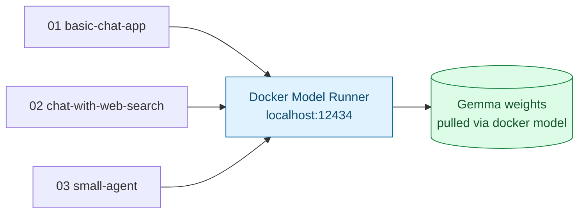

# Local Model Setup — Gemma via Docker Model Runner

Shared infrastructure for all three apps in this series ([01](../01-basic-chat-app/), [02](../02-chat-with-web-search/), [03](../03-small-agent/)). Every app is a plain Python script that talks over HTTP to whatever's running here — none of them call a hosted API or need an API key, per [Note 3 §5](../../notes/03-techs-and-tools.md#5-embeddings--local-models) (run open models locally, no API key/cost while iterating).

## 1. What's Running Here

[Docker Model Runner](https://docs.docker.com/ai/model-runner/) is a feature built into Docker Desktop (and Docker Engine on Linux) that downloads open-weight models and serves them over a local, OpenAI-compatible HTTP API — no separate container to manage, no `docker-compose.yml` to bring up. Enabling it starts a small inference server on the host that stays up alongside Docker itself.



## 2. Enable Docker Model Runner

In Docker Desktop: **Settings → Features in development → Beta features**, enable **Docker Model Runner**, and turn on **Enable host-side TCP support** on port `12434` (this is what makes the API reachable at `localhost:12434` from outside Docker).

Or from the CLI:

```bash
docker desktop enable model-runner --tcp=12434
```

(Exact menu names/flags vary by Docker Desktop version — run `docker model --help` to confirm the plugin is installed.)

Check it's up:

```bash
curl http://localhost:12434/v1/models
```

## 3. Pull a Gemma Model

```bash
docker model pull docker.io/ai/gemma4:E4B
```

| Tag | When to use |
| --- | --- |
| `docker.io/ai/gemma4:E4B` | **Default for this series** — a good reasoning/speed balance for a laptop |
| Other `ai/gemma*` tags | Browse available Gemma tags with `docker model list` after pulling, or on [Docker Hub's AI catalog](https://hub.docker.com/u/ai) if you need a smaller/larger variant |

All three apps read the tag from the `DMR_MODEL` environment variable (default `docker.io/ai/gemma4:E4B`), so switching models doesn't require touching any code:

```bash
export DMR_MODEL=docker.io/ai/gemma4:E4B
```

Sanity-check the model directly before running any app:

```bash
docker model run docker.io/ai/gemma4:E4B "Say hi in five words."
```

## 4. Point the Apps at It

Each app defaults to `DMR_BASE_URL=http://localhost:12434/v1`, which is correct as long as host-side TCP support is enabled on port `12434`. Override it only if you're running Docker Model Runner somewhere else, or your Docker Desktop version exposes the OpenAI-compatible route under `/engines/v1` instead of `/v1`:

```bash
export DMR_BASE_URL=http://localhost:12434/v1
```

The apps use the `openai` Python client pointed at that base URL. Docker Model Runner doesn't check the API key, but the client library requires a non-empty string, so the apps pass a placeholder (`"not-needed"`).

## Gotchas

| Symptom | Likely cause | Fix |
| --- | --- | --- |
| `curl: (7) Failed to connect` | Docker Model Runner not enabled, or host-side TCP support is off | Re-check step 2; confirm with `docker model status` if your version has it |
| App errors with "model not found" | Model tag was never pulled | `docker model pull <tag>` |
| `404` on `/v1/chat/completions` | This Docker Desktop version exposes the OpenAI route at `/engines/v1` instead of `/v1` | `export DMR_BASE_URL=http://localhost:12434/engines/v1` |
| First reply is very slow | Model is loading into memory for the first time | Normal — subsequent replies are faster while it stays loaded |
| Machine grinds to a halt / model unloads under memory pressure | Model too large for available RAM | Switch to a smaller Gemma tag via `DMR_MODEL` |
| Port 12434 already in use | Another process is bound to it | Stop the other process, or change the TCP port Docker Model Runner uses and update `DMR_BASE_URL` to match |

## What's Next

1. **[01 — Basic Chat App](../01-basic-chat-app/README.md)** — a plain LLM app: one call in, one reply out, no tools.
2. **[02 — Chat With Web Search](../02-chat-with-web-search/README.md)** — the model decides whether to call one tool.
3. **[03 — Small Agent](../03-small-agent/README.md)** — a full multi-step, multi-tool ReAct loop with guardrails.
