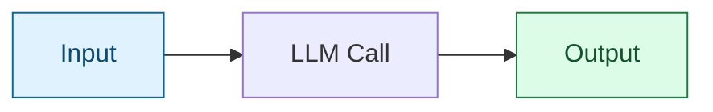

# Step 0 — Overview and Concepts

> [Back to index](README.md) · Next: [Environment Setup](02-environment-setup.md)

## Goal

Before writing any code, agree on what we're building and what to call its pieces. Five minutes here saves confusion later.

## The mental model

Everything in this walkthrough reduces to one shape:

Text goes in, a single model call produces text, nothing decides to act on the world. That's it. This is what's called a **Plain LLM App** — the simplest of the three system shapes you'll see across this code series (the other two, covered in later steps, are a model that can *choose* to call one tool, and a full multi-step agent loop).

## Why this isn't "just a chatbot with extra steps"

Worth being precise, because trainees often assume "chatbot" and "agent" are the same thing with different marketing. They aren't. The line is drawn by three questions:

| Question | This app | An agent |
| --- | --- | --- |
| Who decides when the conversation continues? | The human, by typing another message | The system itself, based on whether the goal is met |
| Does the model choose to use tools? | No tools exist | Yes — the model decides *whether*, *when*, and *how* |
| Is there multi-step planning? | No — one call per turn | Yes — reason, act, observe, repeat |

Turn-taking here is fixed: user asks, model answers, wait for the next user message. The model never decides *whether* to keep going — the loop only continues because a human keeps typing. That's a chatbot, full stop, and it's a perfectly good starting point.

## Vocabulary you'll need

- **System prompt** — a message with `role: "system"` that sets the assistant's behavior before any user input. Sent once, but re-sent every turn as part of the message list (the API is stateless).
- **Message roles** — `system`, `user`, `assistant`. Every major LLM SDK uses this same `{"role": ..., "content": ...}` shape, so this pattern transfers directly to hosted APIs (OpenAI, Anthropic, etc.) later.
- **Short-term memory** — the running list of messages resent on every call. The model has no memory of its own between HTTP requests; *you* are the memory.
- **Streaming** — receiving the reply as a sequence of small chunks (tokens) as they're generated, instead of waiting for the whole response. Purely a UX improvement — it doesn't change what the model produces.
- **Context window** — the maximum number of tokens a model can consider at once (prompt + history + reply). An ever-growing message list eventually exceeds it.

## What you'll have by the end

Two scripts, built in this order:

1. `single_prompt.py` — proves the connection works with the smallest possible program.
2. `chat.py` — the full interactive loop, built up in five layers: skeleton → real API call → streaming → bounded memory → CLI flags and error handling.

## Learning objectives checklist

By the end of this walkthrough you should be able to:

- [ ] Explain the three system shapes (plain app, tool-using app, agent) and where this app sits.
- [ ] Explain why the message list must be resent on every call.
- [ ] Explain what `stream=True` changes and what it doesn't.
- [ ] Explain the specific failure mode that unbounded history causes, and how `trim_history()` prevents it.
- [ ] Read an `openai`-client error and know where to look for the fix.

Next: **[Environment Setup](02-environment-setup.md)**.
