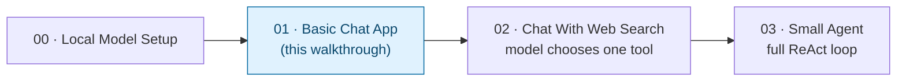

# Basic Chat App — Trainer Walkthrough

> A step-by-step build guide for [../01-basic-chat-app](../01-basic-chat-app/README.md). Follow it live in a workshop, or work through it solo — by the end you will have hand-built a working local-LLM chat loop and understand every line of it, instead of having copy-pasted a finished script.

## What you'll build

Starting from an empty folder, you will incrementally build two small Python programs that talk to a local Gemma model served by Docker Model Runner:

1. **`single_prompt.py`** — send one prompt, get one reply, exit. The simplest possible LLM call.
2. **`chat.py`** — a full interactive chat loop with conversation memory, streaming output, a bounded history window, and configurable model/endpoint flags.

Both end up functionally identical to the reference implementation in [../01-basic-chat-app/](../01-basic-chat-app/) — that folder is your answer key if you (or a trainee) gets stuck.

## Who this is for

- **Instructors** demonstrating, live, how a "Plain LLM App" gets built up from nothing.
- **Trainees** typing the code themselves, one capability at a time, rather than reading a finished file top to bottom.

## Prerequisites

- Comfortable with basic Python: functions, loops, dicts, `try`/`except`.
- [`uv`](https://docs.astral.sh/uv/) installed.
- Docker Desktop with Docker Model Runner enabled (covered in [Step 0](02-environment-setup.md) of this walkthrough).
- About 60–75 minutes end to end.

No prior agent or LLM-framework experience is assumed — this is deliberately the plainest possible starting point.

## How this walkthrough is organized

Each step adds exactly one capability and explains **why** it's needed before showing **how** to add it. Every step ends with a **Checkpoint**: the complete file as it should look at that point, so nobody falls out of sync with the group.

| Step | File | What you'll add | Est. time |
| --- | --- | --- | --- |
| 0 | [01-overview-and-concepts.md](01-overview-and-concepts.md) | Mental model: what a "Plain LLM App" is, and why this isn't an agent | 5 min |
| 1 | [02-environment-setup.md](02-environment-setup.md) | Local model running, project scaffolded, dependency installed | 10 min |
| 2 | [03-single-prompt-script.md](03-single-prompt-script.md) | `single_prompt.py` — one prompt in, one reply out | 10 min |
| 3 | [04-chat-loop-skeleton.md](04-chat-loop-skeleton.md) | `chat.py` — the REPL loop mechanics (no LLM call yet) | 5 min |
| 4 | [05-conversation-memory.md](05-conversation-memory.md) | Wire in the real API call + a `messages` list for memory | 10 min |
| 5 | [06-streaming-responses.md](06-streaming-responses.md) | Token-by-token streaming output | 5 min |
| 6 | [07-bounded-memory.md](07-bounded-memory.md) | `trim_history()` — stop the transcript growing forever | 10 min |
| 7 | [08-cli-flags-and-error-handling.md](08-cli-flags-and-error-handling.md) | `--model`/`--base-url` flags, friendly connection errors | 10 min |
| 8 | [09-recap-and-exercises.md](09-recap-and-exercises.md) | Quick-reference card, gotchas, exercises, what's next | 10 min |

## Relationship to the reference implementation

The finished code you arrive at matches [../01-basic-chat-app/chat.py](../01-basic-chat-app/chat.py) and [../01-basic-chat-app/single_prompt.py](../01-basic-chat-app/single_prompt.py) line for line by the end of Step 7. This walkthrough sequences the *build order* differently from the finished file (skeleton before wiring, non-streaming before streaming) because that's a better teaching order — not because the underlying app is different.

## Suggested demo flow (for instructors)

- Live-type each step rather than pasting — trainees follow typos and fixes better than a perfect paste.
- After each step's checkpoint, pause and run the script before moving on. Nothing here should stay broken for more than one step.
- Step 6 (bounded memory) is easiest to *prove* by temporarily setting `MAX_TURNS_KEPT = 2` and showing the model forget an early fact — see that step's "Try it" section.
- Step 8's exercises work well as a 10–15 minute independent lab if you're running a longer session.

## Where this fits in the series

This walkthrough only covers Step 1. Once trainees can explain every line of `chat.py`, they're ready for [../02-chat-with-web-search/](../02-chat-with-web-search/), where the model starts deciding things for itself.

Start here: **[01-overview-and-concepts.md](01-overview-and-concepts.md)**.
