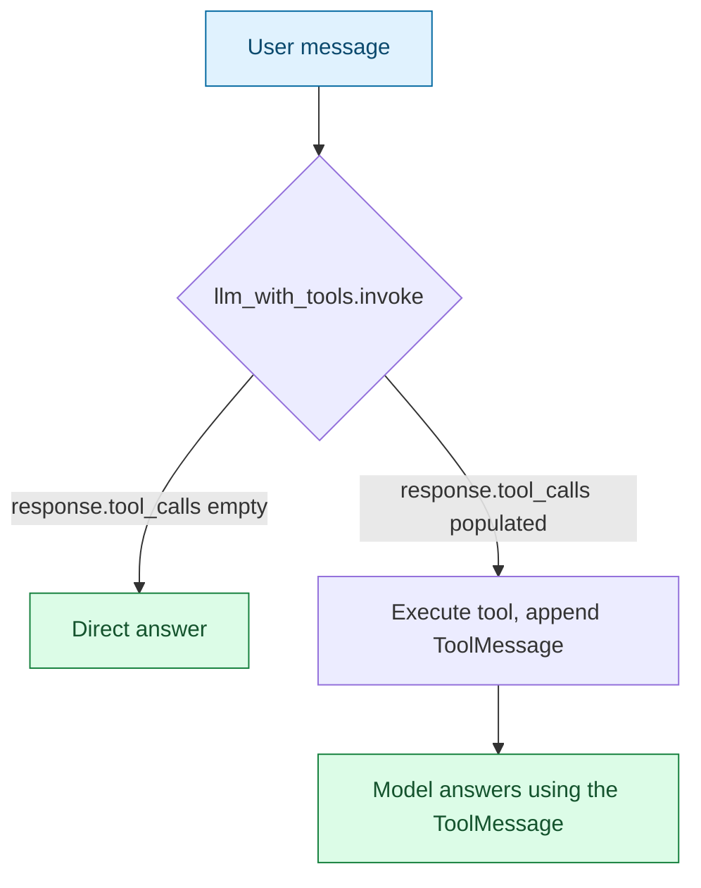

# Step 0 — Overview and Concepts

> [Back to index](README.md) · Next: [Environment Setup](02-environment-setup.md)

## Goal

Understand exactly what changes — and what doesn't — when tool-calling moves from a hand-rolled text protocol to LangChain's native `bind_tools()`, before touching any code.

## Why this matters

[02-chat-with-web-search](../02-chat-with-web-search/) taught Gemma a plain-text convention in its system prompt: reply with a line like `ACTION: web_search {"query": "..."}`, then regex that back out of the raw text (`ACTION_NAME_PATTERN`, `JSON_OBJECT_PATTERN`, `try_parse_action`). That design wasn't arbitrary — it exists because small local models served through Docker Model Runner's OpenAI-compatible endpoint weren't assumed to reliably honor the provider-native "tools" API parameter the way hosted frontier models do.

This variant tests that assumption directly. `ChatOpenAI(...).bind_tools([web_search])` sends the tool's schema as a proper structured field on the API request, and the model is expected to reply with a structured `tool_calls` field instead of (or alongside) plain text. If your model tag honors that reliably, an entire layer of hand-written parsing simply has no reason to exist. If it doesn't, you're back to needing the text-protocol fallback. Neither answer is assumed here — you'll test it yourself in Step 3.

## What changes vs. the hand-rolled version

| Concern | Hand-rolled ([02-chat-with-web-search](../02-chat-with-web-search/)) | This app |
| --- | --- | --- |
| Telling the model a tool exists | `tools_prompt_block()` renders tool names/descriptions into the system prompt by hand | `@tool` docstring + type hints; `bind_tools()` generates the schema and sends it as a real API field |
| Deciding a tool was called | Regex over the raw text reply | `response.tool_calls` — already parsed, already validated against the tool's schema |
| Malformed arguments | Caught by hand in `resolve_tool_call`, fed back as a `ValidationError` message | Handled before the call reaches your code — the API-level schema constrains what the model can even emit |
| Hallucinated tool name | `difflib.get_close_matches` suggests the nearest real tool | Still guarded in `run_turn()`, but far less likely to trigger — the model picks from an explicit tool list rather than free-texting a name |
| Result fed back to the model | A `user`-role message containing `Observation: ...` | A `ToolMessage` tied to the originating `tool_call_id` |

What does **not** change: the tool itself (same `ddgs` backend, same `has_more`/`total` return shape), and the "at most one tool hop per turn, with a bounded number of self-correction retries" behavior. This is a rebuild of the mechanism, not a redesign of the app.

## Vocabulary you'll need

- **`@tool`** (`langchain_core.tools`) — decorator that turns a plain Python function into a `StructuredTool`. It infers the argument schema from the function's type hints and the description from its docstring — no separate Pydantic model to maintain by hand.
- **`bind_tools(tools)`** — returns a new callable model that, on every `.invoke(...)`, sends the bound tools' schemas to the API as a `tools` parameter, so the model knows what's available without it being spelled out in the system prompt text.
- **`response.tool_calls`** — a list of already-parsed, already-validated tool calls on the model's reply, each a dict with `name`, `args`, and `id`. Empty when the model chose to answer directly.
- **`ToolMessage`** — a chat message type that represents "here is what a tool call returned," linked back to the specific call via `tool_call_id` — the structurally correct way to report a tool result, as opposed to smuggling it into a `user`-role message.
- **`AIMessage`** — the model's own turn, including any `tool_calls` it made. It has to be appended to the running `messages` list *before* the corresponding `ToolMessage`s, mirroring how the underlying chat API expects the transcript to be shaped.

## What you'll have by the end

The finished `chat_with_tools.py`, built in five layers: define the tool → bind it and inspect a raw decision → execute the decision and round-trip the result → add bounded retries and guardrails → wrap it all in a CLI and REPL loop.

## Learning objectives checklist

- [ ] Explain what `bind_tools()` sends to the API that a hand-rolled system prompt doesn't.
- [ ] Explain what's inside `response.tool_calls` and why it's already validated.
- [ ] Explain why a `ToolMessage` needs a `tool_call_id`, not just content.
- [ ] Explain which piece of the hand-rolled retry logic *survives* this rebuild, and why.
- [ ] Run both apps against the same two prompts and describe what actually differed.

Next: **[Environment Setup](02-environment-setup.md)**.
