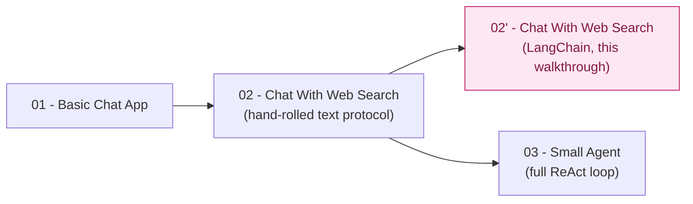

# LangChain Tool-Calling Variant — Trainer Walkthrough

> A step-by-step build guide for [../02-chat-with-web-search-langchain](../02-chat-with-web-search-langchain/README.md) — the same one-tool chat app as [02-chat-with-web-search](../02-chat-with-web-search/README.md), rebuilt on [LangChain](https://python.langchain.com/)'s native tool-calling instead of a hand-rolled text protocol.

This is a **comparison walkthrough**, not a from-scratch one. It assumes you (or your trainees) already built or read [02-chat-with-web-search](../02-chat-with-web-search/) — the REPL loop, CLI flags, and error handling are identical patterns to what that app (and [01-basic-chat-app](../01-basic-chat-app-walkthrough/README.md)) already taught. Every step here is framed as: *here's the hand-rolled code this replaces, and here's what LangChain does instead.*

## What you'll build

A single script, [chat_with_tools.py](../02-chat-with-web-search-langchain/chat_with_tools.py) — an interactive chat loop where the model can call a `web_search` tool through LangChain's `bind_tools()` / `response.tool_calls`, instead of the hand-rolled `ACTION: web_search {"query": "..."}` text protocol the original app teaches in its system prompt.

## Who this is for

- **Instructors** demonstrating what a tool-calling framework actually buys you, line by line, against a hand-rolled baseline the trainees already understand.
- **Trainees** who have completed [02-chat-with-web-search](../02-chat-with-web-search/) (read it, or better, built it) and want to see the same behavior implemented a different way.

## Prerequisites

- Completed [01-basic-chat-app-walkthrough](../01-basic-chat-app-walkthrough/README.md), or equivalent comfort with the REPL-loop / `messages` list / CLI-flags pattern.
- Read (ideally built) [02-chat-with-web-search](../02-chat-with-web-search/) — this walkthrough does not re-explain `try_parse_action`, `resolve_tool_call`, or why a text protocol was used in the first place; it assumes you already know.
- Local model running — see [00-local-model-setup/README.md](../00-local-model-setup/README.md) (skip if already running from an earlier step in the series).
- About 45–55 minutes end to end — shorter than the hand-rolled walkthrough because the loop mechanics aren't new here.

## How this walkthrough is organized

| Step | File | What you'll add | Est. time |
| --- | --- | --- | --- |
| 0 | [01-overview-and-concepts.md](01-overview-and-concepts.md) | Mental model: native tool-calling vs. the text protocol, vocabulary | 5 min |
| 1 | [02-environment-setup.md](02-environment-setup.md) | Install `langchain-openai`, confirm the local model is reachable | 5 min |
| 2 | [03-defining-the-tool.md](03-defining-the-tool.md) | `@tool`-decorated `web_search()` | 10 min |
| 3 | [04-binding-tools-and-raw-decisions.md](04-binding-tools-and-raw-decisions.md) | `bind_tools()`; inspect a raw `response.tool_calls` decision | 10 min |
| 4 | [05-executing-the-tool-call.md](05-executing-the-tool-call.md) | Execute the call, round-trip the result via `ToolMessage` | 10 min |
| 5 | [06-retries-and-guardrails.md](06-retries-and-guardrails.md) | Bounded retries and the unknown-tool guard | 5 min |
| 6 | [07-assembling-the-cli-and-loop.md](07-assembling-the-cli-and-loop.md) | `argparse` flags, the REPL loop, connection-error handling | 10 min |
| 7 | [08-recap-and-exercises.md](08-recap-and-exercises.md) | Quick-reference card, tradeoffs table, exercises | 10 min |

## Relationship to the reference implementation

The finished script matches [../02-chat-with-web-search-langchain/chat_with_tools.py](../02-chat-with-web-search-langchain/chat_with_tools.py) exactly by the end of Step 6 — this was verified by statically compiling every checkpoint in this walkthrough and diffing the final one against the real file, byte for byte.

## Suggested demo flow

- Keep [02-chat-with-web-search/chat_with_tools.py](../02-chat-with-web-search/chat_with_tools.py) open in a second pane throughout — almost every step here is phrased as a diff against a specific function there, not new material.
- Step 3 is the payoff moment: run the same two prompts (one arithmetic, one current-events) through both apps side by side, and show trainees the raw `response.tool_calls` list next to the hand-rolled version's regex match. That's the whole pitch for this variant, made visible instead of asserted.
- Don't let "LangChain removes the parsing" become "LangChain removes all the hand-written logic" — Step 5's retry loop is still there, still hand-rolled, for the same reason it existed in the original app. Call this out explicitly; it's the most commonly missed point in this comparison.
- If your model tag doesn't reliably emit tool calls (see this app's own README gotchas), that's not a bug in the walkthrough — it's the exact assumption this variant exists to test. Show it happening live rather than treating it as a failure to fix.

## Where this fits in the series

This walkthrough covers the 2′ branch only — a side-by-side comparison, not a new concept in the series. Once you can explain every diff against the hand-rolled version, the same question (how much of the hand-rolled control loop does a framework remove, and what does that cost) comes up again, at a much larger scale, in [03-small-agent-langgraph](../03-small-agent-langgraph/README.md).

Start here: **[01-overview-and-concepts.md](01-overview-and-concepts.md)**.
