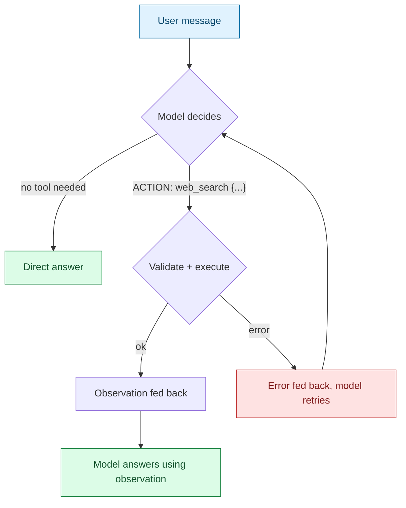

# Step 0 — Overview and Concepts

> [Back to index](README.md) · Next: [Environment Setup](02-environment-setup.md)

## Goal

Understand exactly what capability this app adds on top of [01-basic-chat-app](../01-basic-chat-app/README.md) — and just as importantly, what it deliberately still doesn't do — before touching any code.

## Why this matters

It's tempting to think "chat app + a tool = agent." It isn't automatically true. A chatbot that always searches before answering, or never searches at all, isn't making a decision — it's just following a fixed route. The test that actually matters is: **does the model decide, per turn, whether it needs the tool, and if so, what to search for?** If a human could replace the model with an `if` statement and get the same behavior, nothing agentic is happening yet.

This app clears that bar — the model genuinely chooses, every turn, whether to call `web_search` — but it stops short of being a full agent in one specific way: it resolves in **at most one tool hop** per turn. The model can search once, see the result, and answer. It cannot look at that result, decide it needs to search again with a refined query, and loop. That multi-step capability is exactly what [03-small-agent](../03-small-agent/README.md) adds next.



## Why there's no native "tools" API parameter

Hosted frontier models (Claude, GPT) support a provider-native `tools` parameter: you hand the API a JSON schema, and it replies with a structured tool-call field. Small local models served through Docker Model Runner — Gemma included — don't reliably honor that parameter the same way. So instead of depending on it, this app teaches the model the same underlying idea (a name plus typed arguments) as **plain text in the system prompt**:

```text
ACTION: web_search {"query": "your search query"}
```

and then hand-rolls, in Python, everything a "tools" API parameter would otherwise do for you: telling the model what's available, recognizing when it tried to use one, validating the arguments, running it, and feeding the result back. That's more code than calling `bind_tools()`, but it means nothing about tool-calling is hidden from you — every failure mode is something you wrote the handling for yourself. (The [LangChain variant](../02-chat-with-web-search-langchain-walkthrough/README.md) of this same app shows the other end of that tradeoff, once you're ready to compare.)

## Vocabulary you'll need

- **Tool contract** — a tool isn't just "a Python function the model happens to call." It's three things bundled together: a **name**, a **typed argument schema** (so a malformed call can be rejected before it runs), and a **predictable return shape** (so the caller never has to guess what came back).
- **`ACTION:` line** — the text protocol this app teaches the model: a single line naming the tool plus a JSON object of arguments.
- **Tool hop** — one round trip of: model decides to call a tool → app validates and executes it → app feeds the result back → model produces a final answer. This app allows exactly one hop per user turn.
- **Observation** — the result of running a tool, fed back to the model as a new message so it can use that information in its answer.
- **Bounded return shape** — a tool result that's explicit about being partial (`{"results": [...], "has_more": true, "total": 6}`) instead of a bare list that could be mistaken for "everything there is."

## What you'll have by the end

The finished `tools.py` and `chat_with_tools.py`, built in this order: define the tool contract → prove the model can express a decision in text → parse that decision → validate and execute it → round-trip the result → add bounded retries for when the model gets the format wrong → wrap it all in a CLI and REPL loop.

## Learning objectives checklist

- [ ] State the one-sentence test for "is this actually agentic" and apply it to this app.
- [ ] Explain why this app teaches tool-calling as text instead of using a `tools` API parameter.
- [ ] Explain what "one tool hop" means and name the one thing this app cannot do that would require more than one.
- [ ] Describe the three things a "tool contract" bundles together, and why each one exists.

Next: **[Environment Setup](02-environment-setup.md)**.
