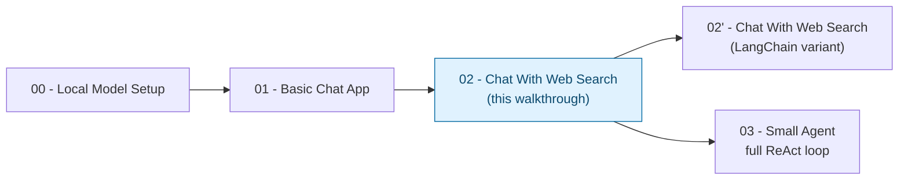

# Chat With Web Search — Trainer Walkthrough

> A step-by-step build guide for [../02-chat-with-web-search](../02-chat-with-web-search/README.md) — the same chat loop as [01-basic-chat-app](../01-basic-chat-app-walkthrough/README.md), plus one `web_search` tool the model can choose to call. Follow it live in a workshop, or work through it solo — by the end you will have hand-built the tool-calling mechanism yourself, instead of having read a finished file top to bottom.

## What you'll build

Starting from an empty folder, you will incrementally build two Python files that give a local Gemma model (served by Docker Model Runner) exactly one optional capability:

1. **`tools.py`** — a `web_search` tool defined as a contract: a typed argument schema, a bounded return shape, and a description string.
2. **`chat_with_tools.py`** — a chat loop where the model reads a plain-text instruction in its system prompt, decides per turn whether it needs to search, and — if it does — the app validates the call, runs it, and feeds the result back for a final answer, all within a single tool hop.

Both end up functionally identical to the reference implementation in [../02-chat-with-web-search/](../02-chat-with-web-search/) — that folder is your answer key if you (or a trainee) gets stuck.

## Who this is for

- **Instructors** demonstrating, live, how a chatbot earns the right to be called "agentic" one decision at a time.
- **Trainees** typing the code themselves, one capability at a time, rather than reading a finished file top to bottom.

## Prerequisites

- Completed [01-basic-chat-app-walkthrough](../01-basic-chat-app-walkthrough/README.md), or equivalent comfort with the REPL-loop / `messages`-list / CLI-flags pattern — this walkthrough does not re-teach those mechanics, only what's new here.
- Local model running — see [00-local-model-setup/README.md](../00-local-model-setup/README.md) (skip if it's already running from an earlier step in the series).
- [`uv`](https://docs.astral.sh/uv/) installed.
- About 60–75 minutes end to end.

## How this walkthrough is organized

Each step adds exactly one capability and explains **why** it's needed before showing **how** to add it. Every step ends with a **Checkpoint**: the complete file as it should look at that point, so nobody falls out of sync with the group.

| Step | File | What you'll add | Est. time |
| --- | --- | --- | --- |
| 0 | [01-overview-and-concepts.md](01-overview-and-concepts.md) | Mental model: the chatbot-vs-agent test, the "at most one tool hop" constraint, vocabulary | 5 min |
| 1 | [02-environment-setup.md](02-environment-setup.md) | Project scaffolded, dependencies installed | 5 min |
| 2 | [03-defining-the-tool-contract.md](03-defining-the-tool-contract.md) | `tools.py` — `WebSearchArgs`, `web_search()`, the `TOOLS` registry | 10 min |
| 3 | [04-the-raw-decision.md](04-the-raw-decision.md) | `SYSTEM_PROMPT`, `call_model()`; inspect a raw text decision before parsing anything | 10 min |
| 4 | [05-parsing-the-decision.md](05-parsing-the-decision.md) | `try_parse_action()` — tell "no call", "valid call", and "broken call" apart | 10 min |
| 5 | [06-validating-and-executing.md](06-validating-and-executing.md) | `resolve_tool_call()` — schema validation and fuzzy-match suggestions | 10 min |
| 6 | [07-the-round-trip.md](07-the-round-trip.md) | `run_turn()` — execute the call, feed the observation back, get a final answer | 10 min |
| 7 | [08-bounded-retries.md](08-bounded-retries.md) | Feed validation errors back to the model, capped at `MAX_TOOL_RETRIES` | 5 min |
| 8 | [09-assembling-the-cli-and-loop.md](09-assembling-the-cli-and-loop.md) | `argparse` flags, the REPL loop, connection-error handling | 10 min |
| 9 | [10-recap-and-exercises.md](10-recap-and-exercises.md) | Quick-reference card, gotchas, exercises, what's next | 10 min |

## Relationship to the reference implementation

The finished code you arrive at matches [../02-chat-with-web-search/tools.py](../02-chat-with-web-search/tools.py) and [../02-chat-with-web-search/chat_with_tools.py](../02-chat-with-web-search/chat_with_tools.py) exactly by the end of Step 7 — this was verified by statically compiling every checkpoint in this walkthrough and diffing the final one against the real files.

## Suggested demo flow (for instructors)

- Run the same two prompts throughout — one trivial ("What's 12 * 7?"), one that needs current information ("What's the latest stable version of Python?") — and show the model taking a different path each time. That contrast *is* the lesson; don't skip re-running it after every step.
- Step 3 (the raw decision) is the payoff moment: print the model's raw reply text, unparsed, before writing a single line of regex. Trainees should see the literal `ACTION: web_search {...}` line with their own eyes before you explain how it gets parsed.
- If your model tag never emits the `ACTION:` line, or emits it inconsistently, that's not a bug in the walkthrough — it's the exact reliability gap this app is designed to expose. Show it happening live, then point at Step 7's retry loop as the app's answer to it.
- Step 6 is easy to demo by hand: temporarily change `MAX_TOOL_RETRIES = 2` to `0` and watch the app give up after a single malformed call instead of retrying.
- Keep [01-basic-chat-app/chat.py](../01-basic-chat-app/chat.py) open in a second pane — Step 9 is a smaller, non-streaming version of that same loop, and it's worth naming what got left out (streaming, bounded history) and why.

## Where this fits in the series

Once trainees can explain every line of `chat_with_tools.py`, two paths open up: [../02-chat-with-web-search-langchain-walkthrough/](../02-chat-with-web-search-langchain-walkthrough/README.md) shows the same behavior rebuilt on a framework's native tool-calling, and [../03-small-agent/](../03-small-agent/README.md) generalizes the single tool hop here into a full multi-step loop.

Start here: **[01-overview-and-concepts.md](01-overview-and-concepts.md)**.
