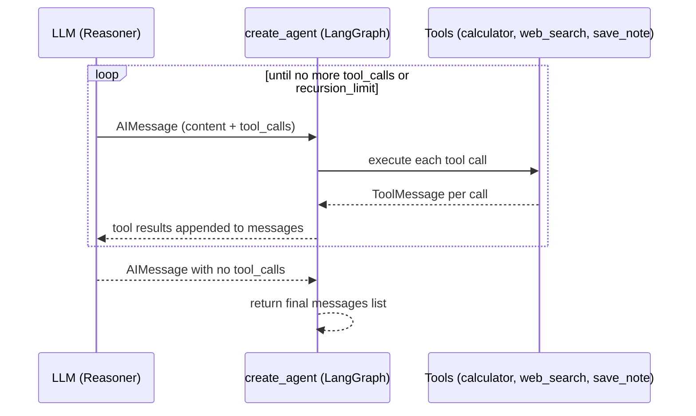

# Step 0 — Overview and Concepts

> [Back to index](README.md) · Next: [Environment Setup](02-environment-setup.md)

## Goal

Understand exactly what `create_agent` replaces — and the one place it *doesn't* cleanly replace — before touching any code.

## Why this matters

[03-small-agent](../03-small-agent/) hand-writes the entire ReAct loop from [Week 2 Note 2 §2](../03-small-agent/README.md): a `Thought:`/`Action:`/`Action Input:`/`Final Answer:` text format spelled out in the system prompt, five regexes (`parse_reply`) to pull that apart, a Pydantic-validating dispatcher (`dispatch_tool_call`) that classifies failures as retryable or not, and a `for step_num in range(1, max_steps + 1)` loop tying it together. That's roughly 270 lines, most of which exist to compensate for one fact: a plain-text reply has to be parsed before you know what the model decided.

This app tests what happens once that fact is no longer true. `create_agent(llm, tools, system_prompt=...)` is LangChain's prebuilt implementation of exactly this loop — call the model, run whatever tool calls it asked for, feed the results back, repeat until the model replies with no more tool calls — driven by native tool-calling through Docker Model Runner's OpenAI-compatible API, the same bet [02-chat-with-web-search-langchain](../02-chat-with-web-search-langchain-walkthrough/README.md) made at a single-tool-hop scale. Here the same bet pays off at the scale of a whole multi-step agent: the loop, the parser, and most of the dispatcher all disappear into one function call.

"Most" is the word to sit with. One piece of the hand-rolled dispatcher — never blind-retrying a side-effecting tool — has no equivalent hook in `create_agent`'s loop, because that loop has no first-class concept of "this specific tool call already failed once, stop the whole run." Step 3 of this walkthrough is where you'll see exactly what has to change to approximate that rule anyway, and exactly how the approximation is weaker than the original.

## What changes vs. the hand-rolled version

| Concern | Hand-rolled ([03-small-agent](../03-small-agent/)) | This app |
| --- | --- | --- |
| The loop itself | `run_agent()`'s `for step_num in range(1, max_steps + 1)`, manually calling the model, parsing, dispatching, appending messages | `create_agent(llm, tools)` — the loop lives inside the compiled graph; you call `.invoke()` once |
| Telling the model what to do next | A `Thought:`/`Action:`/`Action Input:`/`Final Answer:` text format, spelled out with a worked example, in `SYSTEM_PROMPT` | Native tool-calling — the model returns `tool_calls` on its `AIMessage`; no format to teach or parse |
| Parsing the model's decision | `parse_reply()` — five regexes distinguishing "no action," "action with unparseable JSON," and a clean call | Not needed — `response.tool_calls` (surfaced to you as `message.tool_calls`) arrives already structured |
| Hallucinated tool name / bad arguments | `dispatch_tool_call()`: `difflib` suggestion for typos, Pydantic validation for malformed args | Handled before the call reaches your code — the model is choosing from an explicit tool list via the API's tool-schema field, not free-texting a name |
| Step-limit guardrail | `max_steps`, checked directly in the `for` loop | `recursion_limit`, an approximation — see Step 5 |
| Side-effecting tool no-blind-retry rule | `dispatch_tool_call()` checks `tool_failure_counts`, returns `retryable_by_model=False`, which stops the **entire agent run** | Pushed into the tool itself as a closure — weaker in one specific, named way; see Step 3 |

What does **not** change: the three tools' actual behavior (same sandboxed AST-walk calculator, same `ddgs`-backed search, same file write), and the goal of the whole exercise — a model that decides its own steps until it has enough to answer.

## Vocabulary you'll need

- **`create_agent`** (`langchain.agents`, `langchain>=1.0`) — the current home for what used to be `langgraph.prebuilt.create_react_agent`. That older import still works in this app's pinned versions but prints a deprecation warning pointing here. It's still a LangGraph state graph under the hood — the object it returns is a `CompiledStateGraph`, same `.invoke()`/recursion mechanics — only the import path and the `system_prompt=` keyword are new.
- **`CompiledStateGraph`** — what `create_agent(...)` returns. You call `.invoke({"messages": [...]}, config=...)` on it, same shape as any LangGraph graph.
- **`recursion_limit`** — a `config` key bounding how many super-steps the graph will run before raising. Roughly one super-step for the model call, one for the tool-execution node, per round of tool-calling — not a 1:1 count of "ReAct steps" the way `max_steps` was.
- **`GraphRecursionError`** (`langgraph.errors`) — raised when `recursion_limit` is hit without the model reaching a final answer. The equivalent moment to the hand-rolled version's `max_steps` fallback message.
- **Closure-based state** — Python state captured by a nested function's enclosing scope (`nonlocal`) instead of passed explicitly. `make_save_note_tool()` uses this to give a tool "memory" of its own past failures, since there's no controller-level dict to hang that state on the way `tool_failure_counts` did in the hand-rolled dispatcher.

## What you'll have by the end

The finished `agent.py`, built in five layers: port the two idempotent tools → build the side-effecting tool's retry-safety as a closure → wire the model and tools together with `create_agent` → run the graph with a step-limit guardrail → add the trace printer and CLI.

## Learning objectives checklist

- [ ] Explain what `create_agent(llm, tools, system_prompt=...)` replaces, function by function, from the hand-rolled version.
- [ ] Explain why `make_save_note_tool()` is a closure instead of a plain `@tool`-decorated function.
- [ ] Name the one specific way the closure's retry-safety is weaker than the original dispatcher's `retryable_by_model=False`.
- [ ] Explain why `recursion_limit` is set to `max_steps * 2 + 1` rather than `max_steps`.
- [ ] Run both agents on the same goal and describe what actually differed in the trace.

Next: **[Environment Setup](02-environment-setup.md)**.
