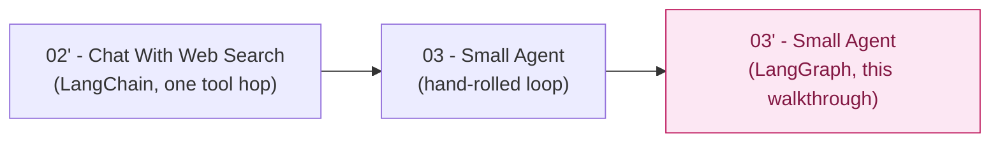

# Small Agent, LangGraph Variant — Trainer Walkthrough

> A step-by-step build guide for [../03-small-agent-langgraph](../03-small-agent-langgraph/README.md) — the same ReAct agent as [03-small-agent](../03-small-agent/README.md), rebuilt on [LangChain](https://python.langchain.com/)'s prebuilt `create_agent` instead of a hand-rolled `Thought`/`Action`/`Observation` loop.

This is a **comparison walkthrough**, not a from-scratch one. It assumes you (or your trainees) already built or read [03-small-agent](../03-small-agent-walkthrough/README.md) — the tool contracts, the idempotent-vs-side-effecting split, and why a step-limit guardrail exists at all are identical concepts to what that walkthrough already taught. Every step here is framed as: *here's the hand-rolled code this replaces, and here's what LangGraph does instead.*

## What you'll build

A single script, [agent.py](../03-small-agent-langgraph/agent.py) — the same three tools (`calculator`, `web_search`, `save_note`) and the same ReAct behavior as the hand-rolled agent, but with `create_agent(llm, tools, system_prompt=...)` doing the work that a ~270-line loop, parser, and dispatcher did by hand.

## Who this is for

- **Instructors** demonstrating how far a prebuilt-agent framework goes once the loop has more than one hop — a bigger payoff than the single-tool comparison in [02-chat-with-web-search-langchain](../02-chat-with-web-search-langchain-walkthrough/README.md).
- **Trainees** who have completed [03-small-agent](../03-small-agent-walkthrough/README.md) (read it, or better, built it) and want to see the same agent implemented a different way.

## Prerequisites

- Completed [03-small-agent-walkthrough](../03-small-agent-walkthrough/README.md), or equivalent comfort with: a tool as a typed contract, the `Thought`/`Action`/`Observation` loop, a validating dispatcher, the idempotent-vs-side-effecting distinction, and the `max_steps` guardrail. This walkthrough does not re-teach any of that from zero — only what changes when a framework owns the loop.
- Local model running — see [00-local-model-setup/README.md](../00-local-model-setup/README.md) (skip if already running from an earlier step in the series).
- About 50-65 minutes end to end — shorter than the hand-rolled walkthrough because the loop's *concepts* aren't new here, only their new home.

## How this walkthrough is organized

| Step | File | What you'll add | Est. time |
| --- | --- | --- | --- |
| 0 | [01-overview-and-concepts.md](01-overview-and-concepts.md) | Mental model: hand-rolled loop vs. `create_agent`, vocabulary | 10 min |
| 1 | [02-environment-setup.md](02-environment-setup.md) | Scaffold the project, install `langchain`/`langchain-openai`/`langgraph` | 5 min |
| 2 | [03-porting-the-tools.md](03-porting-the-tools.md) | `calculator` and `web_search` as `@tool`-decorated functions | 10 min |
| 3 | [04-the-save-note-closure.md](04-the-save-note-closure.md) | `make_save_note_tool()` — the no-blind-retry rule without a custom dispatcher | 15 min |
| 4 | [05-assembling-the-agent.md](05-assembling-the-agent.md) | `build_agent()` — `create_agent(llm, tools, system_prompt=...)` | 10 min |
| 5 | [06-running-the-graph-and-guardrails.md](06-running-the-graph-and-guardrails.md) | `print_trace()`, `run_agent()` — `recursion_limit`, `GraphRecursionError`, the approximate step cap | 10 min |
| 6 | [07-cli-and-interactive-mode.md](07-cli-and-interactive-mode.md) | `argparse` flags, `run_one()`, the interactive loop | 10 min |
| 7 | [08-recap-and-exercises.md](08-recap-and-exercises.md) | Quick-reference card, tradeoffs table, exercises | 10 min |

## Relationship to the reference implementation

The finished script matches [../03-small-agent-langgraph/agent.py](../03-small-agent-langgraph/agent.py) exactly by the end of Step 6 — this was verified by statically compiling every checkpoint in this walkthrough and diffing the final one against the real file, byte for byte.

## Suggested demo flow

- Keep [03-small-agent/agent.py](../03-small-agent/agent.py) open in a second pane throughout. The single most useful thing you can do is put `parse_reply` + `dispatch_tool_call` + `run_agent`'s `for` loop next to `build_agent`'s one call to `create_agent(...)` and let the line-count gap speak for itself.
- Step 3 (the save-note closure) is the payoff moment, and it cuts the other way from Step 2's tools — this is the one place the framework *doesn't* just remove code, it forces a different, slightly weaker way of expressing a rule the hand-rolled dispatcher had a first-class home for. Don't let trainees leave this step thinking "everything got simpler."
- In Step 5, run the same goal through both agents side by side with the trace visible, and count actual tool calls against what `--max-steps` reports in each. That's the concrete evidence for why `recursion_limit = max_steps * 2 + 1` is an approximation, not a translation.
- If your model tag doesn't reliably emit tool calls, that failure mode is identical here to the hand-rolled version's "reply doesn't follow the format at all" case — it's an assumption both apps share, not something specific to this rebuild.

## Where this fits in the series

This is the same "how much of the hand-rolled control loop does a framework remove, and what does that cost" question [02-chat-with-web-search-langchain-walkthrough](../02-chat-with-web-search-langchain-walkthrough/README.md) asked at a single-tool-hop scale — asked again here at the scale of a full multi-step ReAct loop, where the win (and the one real gap) are both much bigger.

Start here: **[01-overview-and-concepts.md](01-overview-and-concepts.md)**.
