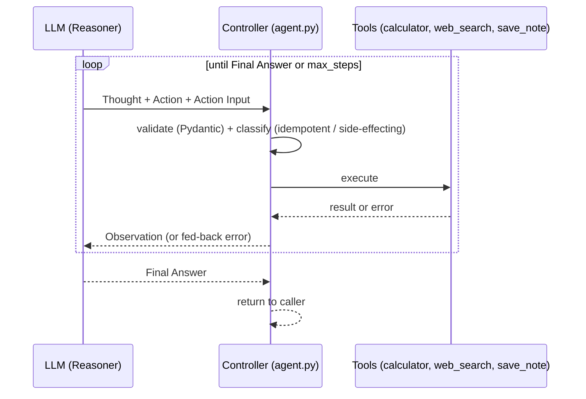

# Step 0 — Overview and Concepts

> [Back to index](README.md) · Next: [Environment Setup](02-environment-setup.md)

## Goal

Understand exactly what generalizing from [02-chat-with-web-search](../02-chat-with-web-search-walkthrough/README.md)'s single tool hop into a full loop means — and learn the vocabulary this app introduces — before touching any code.

## Why this matters

Step 2's chat app clears the "is this agentic" bar: the model decides, per turn, whether it needs `web_search`. But it stops after **at most one tool hop** — search once, see the result, answer. It cannot look at that result, decide it needs a different lookup, and keep going.

This app removes that ceiling. Given a goal, it repeatedly narrates a `Thought`, takes an `Action` (a tool call), reads the `Observation`, and decides **on its own** whether to act again or give a `Final Answer` — for as many steps as it needs, up to a guardrail. That's the difference between a chatbot that can use one tool and a genuine agent: the number of steps is no longer fixed by the code, it's a decision the model makes fresh every turn.



Compare this to Step 2's diagram: there, the loop body ran at most once per user turn. Here, the loop body is the *entire* interaction for one goal — it can run once, or six times, purely because the model decided to chain steps (e.g. search, then calculate on what it found, then answer).

## Why a plain-text protocol, and why a worked example

Like Step 2, this app doesn't rely on a provider-native `tools` API parameter — small local models served through Docker Model Runner don't reliably honor it. Instead, the model is taught a stricter plain-text format than Step 2's single `ACTION:` line, because now there are two things to distinguish turn to turn (still going vs. done) and three tools to choose between:

```text
Thought: <reasoning>
Action: <tool_name>
Action Input: {"key": "value"}
```

or, when it's ready to stop:

```text
Thought: <reasoning for why you're done>
Final Answer: <answer>
```

This app's system prompt goes one step further than Step 2's and includes a **worked example** of a full `Thought`/`Action`/`Action Input` block. A small model can't reliably be trusted to infer a strict multi-line output format from a description alone — showing it one concrete instance to imitate measurably improves how often it actually produces parseable output. You'll see this worked example when you build `SYSTEM_PROMPT` in Step 4.

## Vocabulary you'll need

| Term | Meaning |
| --- | --- |
| **ReAct loop** | `Thought → Action → Observation`, repeated until the model produces a `Final Answer` instead of another `Action` — the reasoning pattern this whole app implements. |
| **Tool hop** | One iteration of the loop: the model calls a tool, the app runs it, the result comes back as an `Observation`. Step 2 allowed exactly one; this app allows as many as `max_steps`. |
| **Step-limit guardrail** | A hard cap (`max_steps`) on how many loop iterations can run before the app gives up and returns a fallback message — the difference between "the model might get stuck" and "the app never hangs." |
| **Idempotent tool** | A read-only or side-effect-free tool (`calculator`, `web_search`) — safe to retry after a transient failure, since running it twice changes nothing beyond the first run. |
| **Side-effecting tool** | A tool that mutates external state (`save_note` writes a file) — retrying it blindly after an ambiguous failure risks a duplicated effect, so this app refuses to auto-retry it at all. |
| **`retryable_by_model`** | A flag the dispatcher attaches to every failure: can the model plausibly fix this itself on the next turn (a typo, bad JSON), or should the loop stop instead of trying again? |
| **Dispatcher** | The function that validates a parsed `(tool_name, args)` pair, decides whether it's safe to run, executes it, and classifies any failure — `dispatch_tool_call()` in this app. |

## What you'll have by the end

The finished `tools.py` and `agent.py`, built in this order: sandboxed calculator → the other two tools and the registry → the prompt and a raw multi-block decision → parsing that decision → validating and executing it → the retry policy that makes validation meaningful → the loop itself, first unbounded, then capped → the CLI and interactive mode wrapping it all.

## Learning objectives checklist

- [ ] State what changed, structurally, between "at most one tool hop" and a full ReAct loop.
- [ ] Explain why this app's system prompt includes a worked example, not just a format description.
- [ ] Define idempotent vs. side-effecting, and explain why `save_note` needs different retry handling than `calculator`.
- [ ] Explain what `retryable_by_model` controls and who ultimately decides whether the loop stops.

Next: **[Environment Setup](02-environment-setup.md)**.
