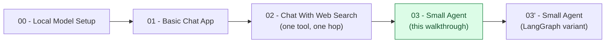

# Small Agent — Trainer Walkthrough

> A step-by-step build guide for [../03-small-agent](../03-small-agent/README.md) — a full ReAct agent that generalizes [02-chat-with-web-search](../02-chat-with-web-search-walkthrough/README.md)'s "at most one tool hop" into a real multi-step loop with three tools and a reliable dispatcher. Follow it live in a workshop, or work through it solo — by the end you will have hand-built the loop, the parser, and the dispatcher yourself, instead of having read a finished file top to bottom.

## What you'll build

Starting from an empty folder, you will incrementally build two Python files that give a local Gemma model (served by Docker Model Runner) three tools and a real agentic loop:

1. **`tools.py`** — three tools as contracts (typed schema, description, bounded return shape): a sandboxed `calculator` (no `eval()`), a `web_search`, and a file-writing `save_note` — plus the `IDEMPOTENT_TOOLS`/`SIDE_EFFECTING_TOOLS` classification that decides how failures are handled later.
2. **`agent.py`** — a `Thought → Action → Observation` loop where the model decides, turn by turn, whether it needs a tool or has enough to give a `Final Answer`, wrapped in a dispatcher that validates every call and a `max_steps` guardrail that stops the loop from running forever.

Both end up functionally identical to the reference implementation in [../03-small-agent/](../03-small-agent/) — that folder is your answer key if you (or a trainee) gets stuck.

## Who this is for

- **Instructors** demonstrating, live, how a single tool hop generalizes into a genuine multi-step agent loop.
- **Trainees** typing the code themselves, one capability at a time, rather than reading a finished 270-line file top to bottom.

## Prerequisites

- Completed [02-chat-with-web-search-walkthrough](../02-chat-with-web-search-walkthrough/README.md), or equivalent comfort with: a tool as a typed contract, parsing a model's raw text decision, a Pydantic-validating dispatcher, and hallucinated-tool-name suggestions via `difflib`. This walkthrough does not re-teach those mechanics from zero — only what generalizing to a full loop adds on top.
- Local model running — see [00-local-model-setup/README.md](../00-local-model-setup/README.md) (skip if it's already running from an earlier step in the series).
- [`uv`](https://docs.astral.sh/uv/) installed.
- About 2–2.5 hours end to end — this app is meaningfully larger than Step 2's single-hop chat app.

## How this walkthrough is organized

Each step adds exactly one capability and explains **why** it's needed before showing **how** to add it. Every step ends with a **Checkpoint**: the complete file as it should look at that point, so nobody falls out of sync with the group.

| Step | File | What you'll add | Est. time |
| --- | --- | --- | --- |
| 0 | [01-overview-and-concepts.md](01-overview-and-concepts.md) | Mental model: single hop vs. full loop, `Thought`/`Action`/`Observation`/`Final Answer` vocabulary, idempotent vs. side-effecting, guardrails | 10 min |
| 1 | [02-environment-setup.md](02-environment-setup.md) | Project scaffolded, dependencies installed, `agent_notes/` gitignored | 10 min |
| 2 | [03-the-calculator-tool.md](03-the-calculator-tool.md) | `tools.py` — `CalculatorArgs`, `calculator()`, sandboxed via a restricted AST walk | 10 min |
| 3 | [04-web-search-save-note-and-the-registry.md](04-web-search-save-note-and-the-registry.md) | `web_search()`, `save_note()`, the `TOOLS` registry, `IDEMPOTENT_TOOLS`/`SIDE_EFFECTING_TOOLS` | 10 min |
| 4 | [05-the-profile-and-reply-format.md](05-the-profile-and-reply-format.md) | `SYSTEM_PROMPT` with a worked example, `call_model()`; inspect a raw multi-block decision | 10 min |
| 5 | [06-parsing-the-reply.md](06-parsing-the-reply.md) | `ParsedReply`, `parse_reply()` — five regexes distinguishing thought/action/input/final-answer | 15 min |
| 6 | [07-the-dispatcher-validating-calls.md](07-the-dispatcher-validating-calls.md) | `ToolError`, `dispatch_tool_call()` — unknown tool, malformed args, schema validation | 10 min |
| 7 | [08-the-dispatcher-retry-policy.md](08-the-dispatcher-retry-policy.md) | The side-effecting no-retry rule and the idempotent-vs-infra-error distinction | 15 min |
| 8 | [09-the-react-loop.md](09-the-react-loop.md) | `run_agent()` — the full loop, unbounded, to prove the round trip works | 15 min |
| 9 | [10-the-max-steps-guardrail.md](10-the-max-steps-guardrail.md) | The `max_steps` cap and its fallback message | 10 min |
| 10 | [11-cli-and-interactive-mode.md](11-cli-and-interactive-mode.md) | `argparse` flags, `run_one()`, the interactive REPL, connection-error handling | 10 min |
| 11 | [12-recap-and-exercises.md](12-recap-and-exercises.md) | Quick-reference card, gotchas, exercises, what's next | 15 min |

## Relationship to the reference implementation

The finished code you arrive at matches [../03-small-agent/tools.py](../03-small-agent/tools.py) and [../03-small-agent/agent.py](../03-small-agent/agent.py) exactly by the end of Step 10 — this was verified by statically compiling every checkpoint in this walkthrough and diffing the final one against the real files (differences are limited to a handful of comments in the real files that cite an internal notes series not included in this checkout; the logic is identical).

## Suggested demo flow (for instructors)

- Keep [../02-chat-with-web-search-walkthrough/](../02-chat-with-web-search-walkthrough/README.md) open in a second pane. The single most useful thing you can do is point at `run_turn()` from that walkthrough next to `run_agent()` here and ask: "what changed to turn one hop into a loop?" The answer is almost entirely `for step_num in range(1, max_steps + 1)` plus a `Final Answer` exit condition — the rest is the same shape, scaled up.
- Step 8 is deliberately built with an unbounded `while True` before Step 9 adds `max_steps`. Run it live on a goal the model handles in 2-3 steps so it looks fine — then ask trainees what happens if the model never converges. Nobody should be fully comfortable with the answer until Step 9 fixes it.
- Step 7's retry-policy step is the app's central lesson and easy to demo without a model at all: call `dispatch_tool_call("save_note", {...}, {"save_note": 1})` directly in a REPL and show the `retryable_by_model=False` result, then do the same for `calculator` with a high failure count and show it's still retryable. That contrast — one line of code, `tool_name in SIDE_EFFECTING_TOOLS` — is the entire idea.
- The worked example inside `SYSTEM_PROMPT` (Step 4) is there because Gemma-sized models can't reliably infer a strict multi-line output format from a description alone. If your model tag ignores the format anyway, that's the exact reliability gap `parse_reply`'s `action is None` fallback and the guardrails in Steps 7–9 exist to contain — show it happening live rather than treating it as a bug in the walkthrough.
- The tax-on-subtotal trap in the real README's example trace (compute a discount, then tax on the *discounted* amount, not the original) is worth reproducing live in Step 10's "Try it" — whether a given Gemma tag gets it right on the first pass is exactly the kind of thing this series' later notes on Reflexion address, and it's more convincing seen live than described.

## Where this fits in the series

Once trainees can explain every line of `agent.py`, [../03-small-agent-langgraph/README.md](../03-small-agent-langgraph/README.md) is worth reading next: the same three tools and the same agent, rebuilt on LangGraph's prebuilt `create_agent`, replacing the hand-rolled loop/parser/dispatcher built here with a single function call — and giving up an exact `max_steps` guardrail and a hard stop-the-whole-run behavior on a failed side-effecting tool in the process.

Start here: **[01-overview-and-concepts.md](01-overview-and-concepts.md)**.
