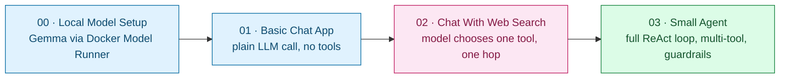

# Week 2 — Agentic AI: Code Series

Three progressively-built Python apps that put the concepts from [../notes/](../notes/) into runnable code, each talking to a **local** model (Gemma, served via Docker Model Runner) instead of a hosted API — no API key or per-token cost while iterating, per [Note 3 §5](../notes/03-techs-and-tools.md#5-embeddings--local-models).

| Step | App | System shape ([Note 2 §1](../notes/02-agent-vs-multiagent-react.md#1-three-system-shapes)) | Key notes it exercises |
| --- | --- | --- | --- |
| 0 | [00-local-model-setup](00-local-model-setup/) | *(infrastructure, not an app)* | [Note 3 §5](../notes/03-techs-and-tools.md#5-embeddings--local-models) |
| 1 | [01-basic-chat-app](01-basic-chat-app/) | Plain LLM App | [Note 1](../notes/01-intro.md), [Note 2 §1](../notes/02-agent-vs-multiagent-react.md#1-three-system-shapes) |
| 2 | [02-chat-with-web-search](02-chat-with-web-search/) | Borderline — model decides whether to use one tool, single hop | [Note 1 §4](../notes/01-intro.md#4-chatbot-vs-agent), [Note 5 §7](../notes/05-agent-details.md#7-tools--action-space), [Note 7](../notes/07-tool-calling.md) |
| 2′ | [02-chat-with-web-search-langchain](02-chat-with-web-search-langchain/) | Same as Step 2, rebuilt on LangChain's native tool-calling instead of a hand-rolled text protocol | Same as Step 2 — a side-by-side comparison, not a new concept |
| 3 | [03-small-agent](03-small-agent/) | Single Agent (ReAct) | [Note 2 §2](../notes/02-agent-vs-multiagent-react.md#2-the-react-loop-reason--act), [Note 5](../notes/05-agent-details.md), [Note 7](../notes/07-tool-calling.md) |
| 3′ | [03-small-agent-langgraph](03-small-agent-langgraph/) | Same as Step 3, rebuilt on LangChain/LangGraph's prebuilt `create_agent` instead of a hand-rolled ReAct loop | Same as Step 3 — a side-by-side comparison, not a new concept |

Each app is a standalone `uv` project (its own `pyproject.toml`, `.gitignore`, lockfile) with a README covering what it does, which notes it implements, how to run it, and its known gotchas. Start with [00-local-model-setup](00-local-model-setup/README.md), then work through 01 → 02 → 03 in order — each README links to the next. [02-chat-with-web-search-langchain](02-chat-with-web-search-langchain/) and [03-small-agent-langgraph](03-small-agent-langgraph/) are optional detours: the same apps, same tools, rebuilt with a framework to see how much of the hand-rolled parsing/looping a library removes — and what it costs to give that control up.
