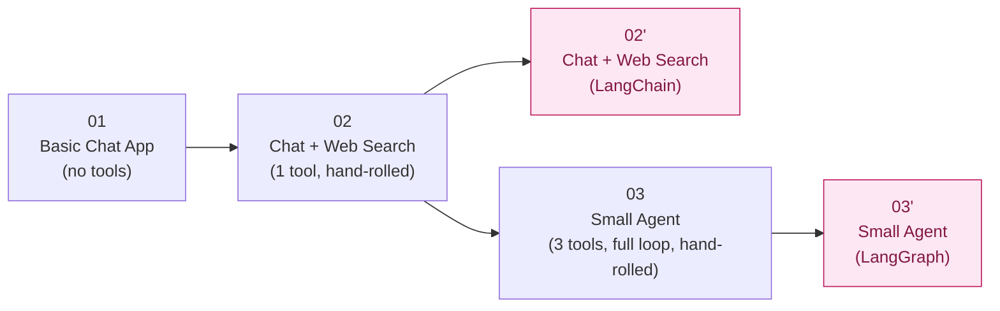
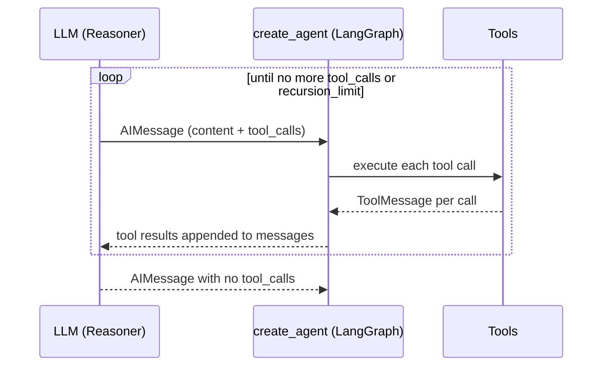

# Agentic AI Series — What Each App Is, and What the Frameworks Actually Buy You

Six pieces of code, one running example (a calculator/search/note-taking assistant), built up in stages: a plain LLM call → one optional tool → a full multi-step agent — each stage built once by hand, then twice more rebuilt on top of a framework so the hand-rolled version and the framework version can be compared line for line. Everything runs against a local Gemma model served by Docker Model Runner — no API keys, no cloud cost.

## The series at a glance

| # | App | Shape | Orchestration | Tools | Size |
| --- | --- | --- | --- | --- | --- |
| 00 | [local-model-setup](00-local-model-setup/) | *(infrastructure, not an app)* | — | — | — |
| 01 | [basic-chat-app](01-basic-chat-app/) | Plain LLM app | Hand-rolled | none | 97 lines |
| 02 | [chat-with-web-search](02-chat-with-web-search/) | Chatbot + one optional tool | Hand-rolled (text protocol) | 1 | 251 lines |
| 02′ | [chat-with-web-search-langchain](02-chat-with-web-search-langchain/) | Chatbot + one optional tool | LangChain (`bind_tools`) | 1 | 151 lines |
| 03 | [small-agent](03-small-agent/) | Full ReAct agent | Hand-rolled (loop + dispatcher) | 3 | 426 lines |
| 03′ | [small-agent-langgraph](03-small-agent-langgraph/) | Full ReAct agent | LangGraph (`create_agent`) | 3 | 250 lines |

The progression matters more than any single app: **01 → 02 → 03** is "how much decision-making does the model get," and **02 → 02′** / **03 → 03′** is "how much of the plumbing around that decision-making can a framework take off your hands, and at what cost." The second question gets a much bigger, more interesting answer at 03′'s scale than at 02′'s — that's the throughline of this whole document.



---

## 00 — Local Model Setup

Not an app — shared infrastructure every other app depends on. Docker Model Runner serves a Gemma model over an OpenAI-compatible HTTP API at `localhost:12434`, so every app below just points the standard `openai` Python client (or a LangChain wrapper around it) at that URL. No API key is checked, but the client library still demands a non-empty string, so every app passes a placeholder (`"not-needed"`).

---

## 01 — Basic Chat App

**What it consists of:** one file, `chat.py`. A `messages` list of `{"role", "content"}` dicts, one call to `client.chat.completions.create(...)` per user turn, the reply appended back into `messages`, and `trim_history()` capping the list to the most recent `MAX_TURNS_KEPT` turns so the transcript doesn't grow forever and crowd out the system prompt.

**What it is not:** there are no tools, and nothing in the loop *decides* anything — it continues only because the human keeps typing. This is the baseline every later app is measured against: a **Plain LLM App**, not yet a chatbot with any agency at all.

No framework involved here — this is the "raw SDK" starting point the rest of the series builds on.

---

## 02 — Chat With Web Search (hand-rolled)

**What it consists of:** `chat_with_tools.py` (182 lines) + `tools.py` (69 lines). Same chat loop as 01, plus exactly one tool, `web_search` (backed by `ddgs`, a no-API-key DuckDuckGo client). Because a small local model can't be trusted to reliably emit a provider-native tool-call JSON blob, the tool is taught to the model as **plain text** in the system prompt:

```text
ACTION: web_search {"query": "your search query"}
```

Everything downstream is hand-rolled to compensate for that being free-text, not a structured field:

| Piece | Job |
| --- | --- |
| `tools_prompt_block()` | Renders the tool's name/schema/description into the system prompt as text |
| `try_parse_action()` | Regexes the `ACTION:` line and its JSON argument back out of the raw reply |
| `WebSearchArgs` (Pydantic) | Validates the parsed arguments before the tool runs |
| `resolve_tool_call()` | Fuzzy-matches a misspelled tool name (`difflib`), surfaces validation errors back to the model |
| `MAX_TOOL_RETRIES` | Caps how many times the model gets to self-correct before the app gives up and answers without the tool |

**What it proves:** the model genuinely *decides* whether to search, per turn — clearing the bar that separates an agent-ish system from "a chatbot with retrieval bolted on." But it still resolves in **at most one tool hop** before answering; there's no loop where it could search, look, and search again. That gap is what 03 closes.

---

## 02′ — Chat With Web Search, LangChain variant

**What it consists of:** a single file, `chat_with_tools.py` (151 lines) — no separate `tools.py` needed. Same `web_search` tool, same DuckDuckGo backend, but described to the model with LangChain's `@tool` decorator and sent via `llm.bind_tools([web_search])` instead of prompt text.

### What LangChain adds here

| Hand-rolled piece | Replaced by | Why |
| --- | --- | --- |
| `tools_prompt_block()` (text description in the prompt) | `@tool`'s inferred schema, sent as a real `tools` API field via `bind_tools()` | The model reads a structured field instead of parsing prose |
| `try_parse_action()` (regex over free text) | `response.tool_calls` — already a parsed list of `{name, args, id}` | Nothing left to regex |
| `WebSearchArgs` (a hand-written Pydantic schema) | Inferred automatically from the function's type hints | One less thing to keep in sync with the function signature |
| A `ToolError`-shaped hand-rolled result | A `ToolMessage`, linked to its call via `tool_call_id` | The structurally "correct" way an OpenAI-style chat API expects a tool result reported |

### What LangChain does *not* remove

The bounded retry loop and the "unknown tool" guard are **still hand-rolled**, on purpose: `bind_tools()` validates a call's *shape* before it reaches your code, but a model can still name a tool that isn't registered, or a tool can still fail at runtime (a network blip). Neither of those is a parsing problem, so no framework removes them. This is the most commonly missed point of this comparison — "LangChain removes the parsing" is not the same claim as "LangChain removes all the hand-written logic."

### The cost at this scale

`langchain-openai` alone pulls in `langchain-core`, `langsmith`, `tiktoken`, and their transitive dependencies — a real weight increase over the hand-rolled version's `openai` + `pydantic`. At this scale (one tool, one hop), the win is real but modest: a smaller `run_turn()`, less code to keep in sync, at the cost of noticeably more installed dependency surface.

---

## 03 — Small Agent (hand-rolled)

**What it consists of:** `agent.py` (271 lines) + `tools.py` (155 lines) — the biggest hand-rolled app in the series. Three tools now (`calculator`, `web_search`, `save_note`), and a real **ReAct loop**: `Thought → Action → Observation`, repeated until the model itself decides it has enough to give a `Final Answer`, capped by a `max_steps` guardrail.

| Component | Job |
| --- | --- |
| `SYSTEM_PROMPT` | Spells out a strict `Thought:`/`Action:`/`Action Input:`/`Final Answer:` format, with a worked example — a small model can't reliably infer a format like this from a description alone |
| `parse_reply()` | Five regexes distinguishing "no action," "action with unparseable JSON," and a clean call |
| `dispatch_tool_call()` | Validates the call (Pydantic), suggests the nearest tool name on a typo, executes it, and classifies any failure as retryable or not |
| `IDEMPOTENT_TOOLS` / `SIDE_EFFECTING_TOOLS` | `calculator`/`web_search` are safe to blindly retry; `save_note` (writes a file) is not — a retried "save" after an ambiguous failure could double-write |
| `run_agent()`'s `for step_num in range(1, max_steps + 1)` | The loop itself, plus the guardrail that stops it from running forever |
| `_eval_node()` | A restricted AST walk powering `calculator` — no bare `eval()`, so the tool can only ever compute arithmetic, no matter what a confused or malicious model sends it |

**What it proves:** a genuine agent by the strict definition — a model that decides its own steps, tools it can call, and state (`messages`) that persists across steps until it converges or hits the guardrail. The "never blind-retry a side-effecting tool" rule lives cleanly in the dispatcher: `retryable_by_model=False` doesn't just skip a retry, it **stops the entire agent run**.

---

## 03′ — Small Agent, LangGraph variant

**What it consists of:** a single file, `agent.py` (250 lines) — no separate `tools.py`, no dispatcher, no parser. The entire hand-rolled loop collapses into:

```python
create_agent(llm, tools, system_prompt=SYSTEM_PROMPT)
```

`create_agent` (from `langchain.agents`, `langchain ≥ 1.0`) is LangChain's current name for what used to be `langgraph.prebuilt.create_react_agent` — it's still a LangGraph state graph under the hood (the object it returns is a `CompiledStateGraph`), just re-homed as the two libraries converge on one prebuilt-agent API.



### What LangGraph adds here — the big win in this series

| Hand-rolled piece (03) | Replaced by (03′) | Why it disappears |
| --- | --- | --- |
| `run_agent()`'s manual `for` loop | The compiled graph's own loop, driven by one `.invoke()` call | The loop is now a library's job, not yours |
| `SYSTEM_PROMPT`'s format + worked example | Nothing — native tool-calling needs no taught format | The model returns `tool_calls` as a structured field |
| `parse_reply()` (5 regexes) | `message.tool_calls` — already parsed | Nothing left to regex |
| `dispatch_tool_call()`'s schema validation + typo suggestion | API-level tool schema, enforced before the call reaches your code | The model picks from an explicit tool list, not free text |
| `max_steps`, checked in the loop | `recursion_limit` in `.invoke()`'s `config` | Same *idea*, different unit — see below |

Net effect: `parse_reply`, `ParsedReply`, `ToolError`, `dispatch_tool_call`, and the manual loop all disappear. What's left is mostly tool definitions plus a ~15-line `build_agent()`/`run_agent()` pair. This is a **much bigger win than 02′'s** — the framework isn't just removing a parser, it's removing an entire hand-written controller.

### The two places this isn't a free simplification

**1. The step-limit guardrail becomes approximate.** `max_steps` used to count `Thought`/`Action` cycles directly. `recursion_limit` counts graph *super-steps* — roughly one for the model call, one for the tool-execution node, per round — so `run_agent()` passes `max_steps * 2 + 1` as an approximation, not a translation. If you need the cap to fire at an exact number of tool calls, you'd have to count `tool_calls` across the message list yourself.

**2. The side-effecting no-retry rule gets structurally weaker.** In 03, a failed `save_note` sets `retryable_by_model=False` and **stops the whole agent run** — the dispatcher has a global view and a decisive lever. `create_agent`'s loop has no such hook: there's no controller-level state to hang that policy on from outside the tool. The workaround, `make_save_note_tool()`, is a **closure**: it returns a fresh `save_note` tool per agent run, carrying its own private `failed_once` flag via `nonlocal`, so a second call within the same run is refused. That protects the file-write side effect — but refusing the second write doesn't halt anything *else* the model might do next; it could still call a different tool or give a Final Answer. Getting the original's exact "stop everything" behavior back would require a custom LangGraph node/conditional edge, which gives up the one-liner simplicity that's the whole point of `create_agent`.

### The cost, at this bigger scale

`langchain`, `langchain-openai`, and `langgraph` together bring a noticeably heavier dependency tree than 03's `openai` + `pydantic`. And the trace itself changes character: 03 *forced* an explicit `Thought: ...` line every step (deliberate auditability); native tool-calling doesn't require the model to narrate anything, so 03′'s trace can be terser or leave out reasoning the hand-rolled version guaranteed you'd see.

---

## The pattern across both comparisons

| | Single tool hop (02 → 02′) | Full ReAct loop (03 → 03′) |
| --- | --- | --- |
| What the framework removes | Text-parsing for one tool call | An entire loop, parser, and most of a dispatcher |
| Relative size reduction | 251 → 151 lines (~40%) | 426 → 250 lines (~41%), but far more *structural* complexity removed |
| What still has to be hand-rolled | Retry loop, unknown-tool guard, the tool itself | The tools themselves, the system prompt's behavioral rules |
| Where the framework quietly gives something up | Nothing structural — just dependency weight | A guardrail's precision (`recursion_limit` ≈ `max_steps`), and a dispatcher-level "stop everything" rule (weakened to a per-tool closure) |

**The takeaway:** a prebuilt-agent framework's value scales with how much control-flow the hand-rolled version had to own. At one tool hop, `bind_tools()` is a nice-to-have that trims a regex layer. At a full multi-step loop with a real dispatcher, `create_agent` removes the loop itself — a much bigger win — but that's also where you start finding rules the hand-rolled controller expressed cleanly (a global "stop the run" flag) that the framework has no first-class place for, forcing a weaker, more local workaround instead. Neither side is a strictly better engineering choice: which one you'd ship depends on whether you need that level of control, and whether your model reliably supports structured tool-calling in the first place.

## Where to go deeper

Each app above has its own README with full run instructions, example traces, and a gotchas table. Two paired trainer walkthroughs also exist if you want to *build* rather than just read:

- [03-small-agent-walkthrough](03-small-agent-walkthrough/README.md) — hand-build the ReAct agent from scratch.
- [03-small-agent-langgraph-walkthrough](03-small-agent-langgraph-walkthrough/README.md) — rebuild it on `create_agent`, step by step, with the closure workaround and the `recursion_limit` approximation each given their own dedicated step.
